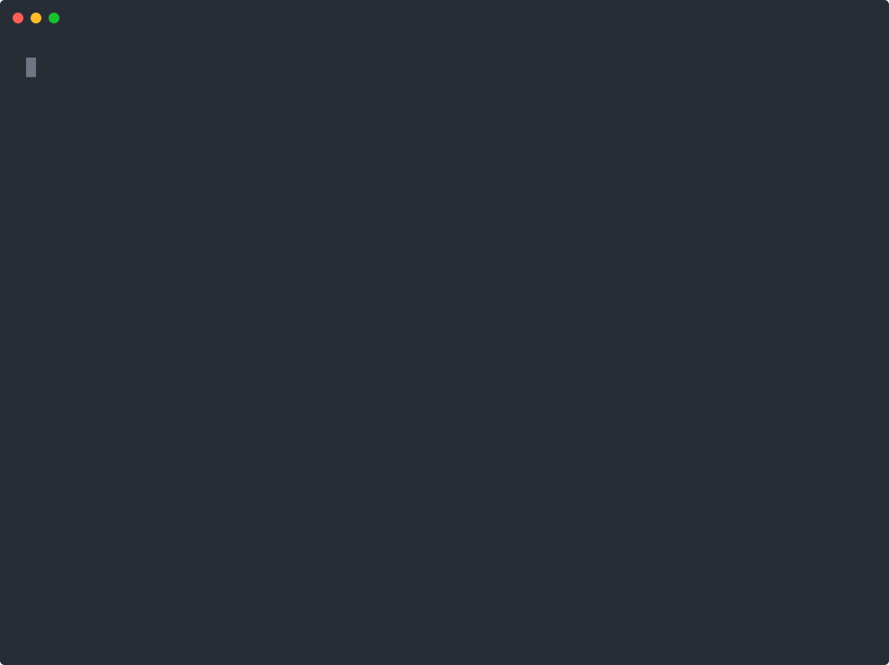

<div align="center">

# Linearis

**A token-efficient [Linear.app](https://linear.app) CLI built for AI agents — and humans who like structured data.**

[](https://www.npmjs.com/package/linearis)
[](https://nodejs.org)
[](https://github.com/linearis-oss/linearis/actions/workflows/ci.yml)
[](LICENSE.md)
[](https://skills.sh/linearis-oss/linearis)

</div>

Linearis is a command-line interface for Linear that speaks **JSON only**. It resolves human-friendly IDs (`ENG-42`, a team name) to UUIDs for you, prompts interactively when a human is at the keyboard, and stays out of the way — pure JSON on stdout — when a script or an agent is driving.

<div align="center">

<em>The same task — creating an issue — from the two audiences Linearis serves.</em>

**A human, interactively** — searchable pickers, multiselect, and a date picker fill the gaps:



**An agent (Claude Code)** — the `linearis` skill drives discover-then-act, then creates the issue:


</div>

## Quick start

```bash
npm install -g linearis   # requires Node.js >= 22
linearis auth login       # opens Linear, stores an encrypted token
linearis issues list --limit 10
```

The `linearis` command is canonical; `linear` is a fully supported alias.

## Why Linearis

The official Linear MCP works well, but it costs ~13k tokens just by being connected — before an agent does anything. Linearis flips that: agents discover capabilities on demand through a two-tier `usage` system, and a typical interaction costs **~500–700 tokens** instead of ~13k.

| | Linearis | Linear MCP |
|---|---|---|
| Context cost | ~500–700 tokens per interaction | ~13k tokens on connect |
| Coverage | Common operations (issues, discussions, cycles, docs, files) | Full Linear API |
| Output | JSON via stdout | Tool-call responses |
| Setup | `npm install -g linearis` + Bash tool | MCP server connection |

> [!NOTE]
> The trade-off is coverage. Linearis focuses on day-to-day work — issues, discussions, cycles, projects, documents, and files. For custom workflows, integrations, or workspace settings, the MCP is the better choice.

## Features

- **JSON-only output** — pipe into `jq`, no parsing of tables or prose.
- **Smart ID resolution** — pass `ENG-42`, a team name, or a UUID interchangeably.
- **Two-tier discovery** — self-documenting `usage` commands keep agent context small.
- **Interactive when it helps** — pickers and field wizards fill missing input in a TTY; hard-gated off for pipes, CI, and agents.
- **Discussion threads** — first-class root/reply modeling on issues.
- **File attachments** — upload and download with signed URLs.
- **Broad domain coverage** — issues, projects, cycles, milestones, initiatives, documents, labels, teams, users, and more.

## Usage

Every command returns JSON. Agents follow a **discover-then-act** loop; humans can jump straight to commands.

```bash
# 1. Discover — a compact overview of every domain (~200 tokens)
linearis usage

# 2. Drill down — the full reference for one domain (~300–500 tokens)
linearis issues usage

# 3. Act
linearis issues list --limit 10
linearis issues search "authentication bug"
linearis issues create "Fix login flow" --team Platform --priority 2
linearis issues read ENG-42          # includes embeds with signed download URLs
```

### Interactive prompts

In a real terminal, Linearis prompts for missing input instead of erroring (see the demo above). The final stdout is always the same JSON; prompts are drawn on stderr.

```bash
linearis issues create                       # auto-launches a wizard (TTY only)
linearis issues create "Fix login" -i        # force interactive; flags still win
linearis issues create "Fix login" --team ENG --no-interactive   # opt out
```

Prompts are hard-gated off whenever stdin/stdout is not a TTY, `CI` or `LINEARIS_NO_INTERACTIVE` is set, or `--no-interactive` / `--compact` / `--fields` is used — so pipes and agents never hang and stdout stays pure JSON.

### Discussions

Discussions are modeled as root threads with replies, not a flat comment list:

```bash
linearis issues discuss ENG-42 --body "Investigating this now"   # start a thread
linearis issues discussions ENG-42                               # list root threads
linearis issues replies <root-thread-id>                         # list replies
linearis issues reply <root-thread-id> --body "Found the cause"  # reply to a thread
```

### Domains

| Domain | What it covers |
|---|---|
| `issues` | Work items with status, priority, assignee, labels, and discussions |
| `projects` | Groups of issues working toward a goal |
| `initiatives` | Strategic, multi-project goals |
| `cycles` | Time-boxed iterations (sprints) per team |
| `milestones` | Progress checkpoints within projects |
| `documents` | Long-form markdown docs attached to projects or issues |
| `labels` | Categorization tags for issues and projects |
| `attachments` | Linked external resources on issues (PRs, commits, URLs) |
| `files` | Upload and download file attachments |
| `teams` | Organizational units owning issues and cycles |
| `users` | Workspace members and assignees |
| `auth` | Authenticate with the Linear API |

Run `linearis <domain> usage` for the complete command and flag reference.

## Authentication

`linearis auth login` is the easy path. To supply a token directly:

```bash
linearis --api-token <token> issues list       # via flag
LINEAR_API_TOKEN=<token> linearis issues list   # via environment variable
```

Resolution order: `--api-token` → `LINEAR_API_TOKEN` → `~/.linearis/token` → `~/.linear_api_token` (deprecated).

## For AI agents

Linearis ships an agent skill (following the [agentskills.io](https://agentskills.io) standard) so your agent knows the discover-then-act protocol with no prompt to paste. It preflights the install and advisory-checks for updates.

```bash
npx skills add linearis-oss/linearis   # any harness — installs for 70+ agents
```

<details>
<summary>Other harnesses</summary>

- **Claude Code** — native plugin:
  ```
  /plugin marketplace add linearis-oss/linearis
  /plugin install linearis@linearis
  ```
- **OpenAI Codex** — `npx skills add linearis-oss/linearis` installs to `~/.agents/skills/`; invoke with `/skills` or `$`.
- **pi** — `npx skills add linearis-oss/linearis` (or drop `skills/linearis/` into `.pi/skills/`); invoke `/skill:linearis`.
- **Google Antigravity** — `npx skills add linearis-oss/linearis` installs to `.agents/skills/`; auto-discovered.

</details>

## Documentation

- [`docs/`](docs/) — architecture, development, testing, and build-system references.
- [MIGRATION_2026.4.9.md](MIGRATION_2026.4.9.md) — migrating from the deprecated `comments` domain to discussions.
- [CONTRIBUTING.md](CONTRIBUTING.md) — contributor guidelines.
- [SECURITY.md](SECURITY.md) — how to report security issues.

## Contributors

<a href="https://github.com/linearis-oss/linearis/graphs/contributors">
  
</a>

Made with [contrib.rocks](https://contrib.rocks).

## License

[MIT](LICENSE.md) — this project is neither affiliated with nor endorsed by Linear.
